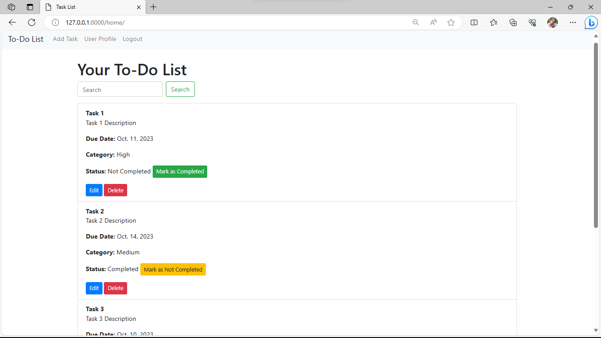

# Django To-Do List Application

This is a simple To-Do List web application built using Django. It allows users to create, manage, and organize their tasks efficiently.

## Features

- User registration and authentication
- Add, edit, and delete tasks
- Mark tasks as completed or not completed
- Task categories and priorities
- Due dates for tasks
- Search and filter functionality
- User profile management

## Prerequisites

Before you begin, ensure you have met the following requirements:

- Python (3.6+)
- Django (3.0+)
- Django Bootstrap Forms (optional for improved form styling)
- A compatible database (e.g., SQLite, PostgreSQL, MySQL)

## Screenshots

